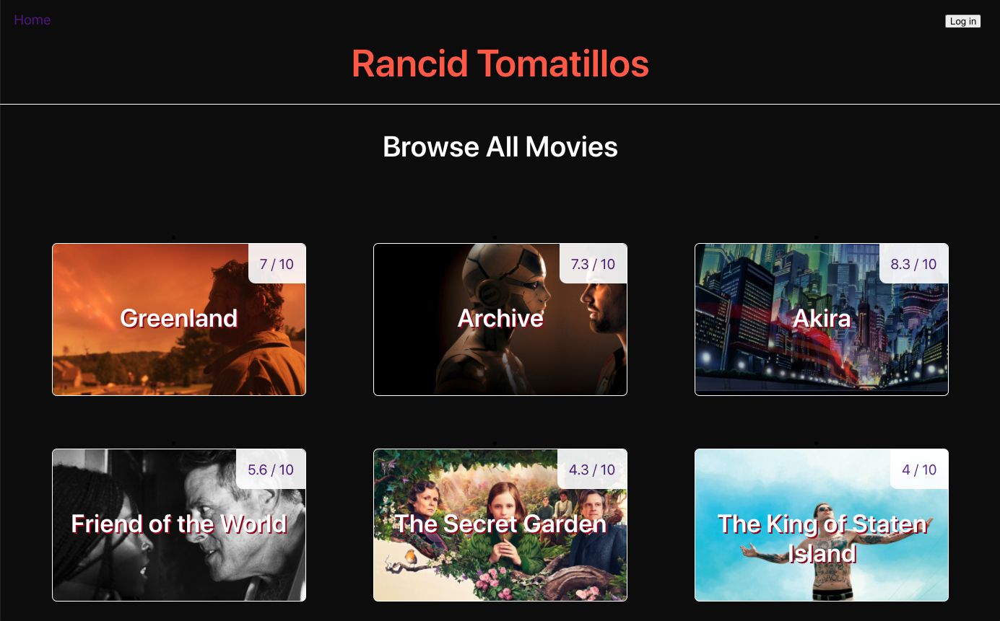
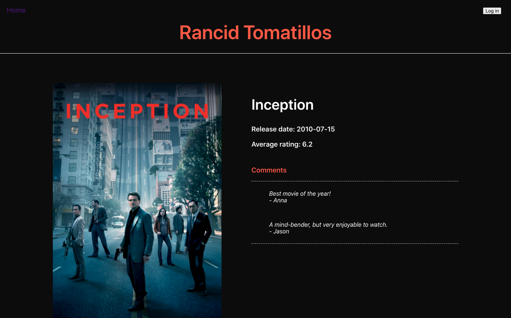
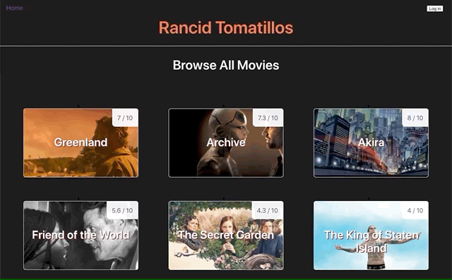

# Rancid Tomatillos
## Abstract
Rancid Tomatillos is a movie rating app where a user can login and rate movies, comment on movies, and favorite/unfavorite movies.  

If a user doesn't have a login, they can view movie details but they aren't able to share their own ratings or comments, and they do not have favoriting capabilities. 

The User Interface is updated seamlessly as the user navigates through a multi-page experience. 

## Contributors  
* [Rachel Williams](https://github.com/rwilliams659)
* [Stephanie Norton](https://github.com/NakiNorton)

## Setup
**Application Setup:**
1. Clone down this repository to your local machine.
2. CD into this repo's directory.
3. Run npm install.
4. Run npm start.
5. In your browser navigate to localhost:3000

**Microservice Setup (to enable favoriting and commenting):**
1. Clone down [this repository](https://github.com/turingschool-examples/rancid-tomatillos-microservice)
2. CD into this repo's directory
3. Run npm install
4. Run npm start

**Login to the application for the full user experience:**  
* username: Diana@turing.io  
* password: 111111

##  In Action
#### Homepage:

#### A Movie Details page:

#### User login:

#### Adding and deleting a movie rating:

#### Adding a comment:

#### Favoriting a movie:

## Technologies
* React & Router
* React-testing-library & Jest
* RESTful API
* JavaScript
* HTML/CSS

## Systems/Practices
* git Version Control
* GitHub Issues/Project Board
* ARIA

